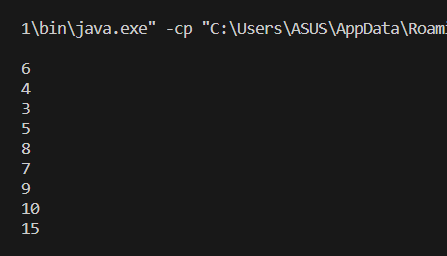
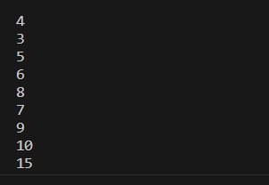
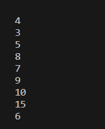
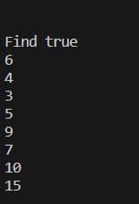
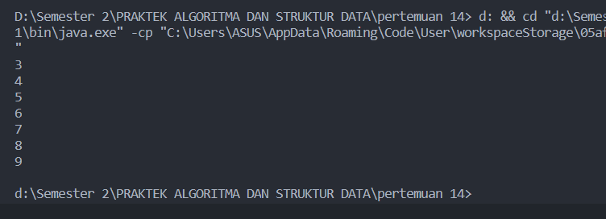
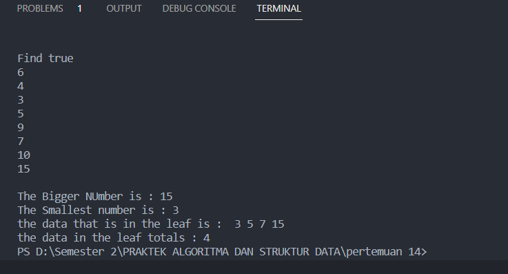

<h1 align="center">

LAPORAN PRAKTIKUM

ALGORITMA DAN STRUKTUR DATA

PERTEMUAN 14


<h2 align="center">

RIZQI REZA DANUARTA

2241720057

TI-1C

### Latihan Praktikum 2.1.1
``` java 
class node {
    int data;
    node left,right;

    public node(){

    }
    public node(int data){
        this.left = null;
        this.data = data;
        this.right = null;
    }

}
public class BinaryTree {
    node root;
    public BinaryTree (){
        node root;
    }
    boolean isEmpty(){
        return root == null;
    }
    void add(int data){
        if(isEmpty()){
            root = new node(data);
        }
        else{
            node current = root;
            while (true) {
                if (data<current.data) {
                    if (current.left != null) {
                        current = current.left;
                    }
                    else{
                        current.left = new node(data);
                        break;
                    }
                }
                else if (data>current.data) {
                    if (current.right!=null) {
                        current = current.right;
                    }
                    else{
                        current.right = new node(data);
                        break;
                    }
                }
                else{ 
                    break;
                }
            }
        }
    }
    boolean find(int data){
        boolean hasil = false;
        node current = root;
        while (current!=null) {
            if (current.data==data) {
                hasil = true;
                break;
            }
            else if (data<current.data) {
                current = current.left;
            }
            else{
                current = current.right;
            }
        }
        return hasil;
    }
    void traversePreOrder(node Node){
        if (Node != null) {
            System.out.println("" + Node.data);
            traversePreOrder(Node.left);
            traversePreOrder(Node.right);
        }
    }
    void traversePostOrder(node Node){
        if (Node != null) {
            traversePreOrder(Node.left);
            traversePreOrder(Node.right);
            System.out.println("" + Node.data);
        }
    }
    void traverseInOrder(node Node){
        if (Node != null) {
            traversePreOrder(Node.left);
            System.out.println("" + Node.data);
            traversePreOrder(Node.right);
        }
    }
    node getSuccessor(node del){
        node successor = del.right;
        node successorParent = del;
        while (successor.left != null) {
            successorParent = successor;
            successor = successor.left;
        }
        if (successor!=del.right) {
            successorParent.left = successor.right;
            successor.right = del.right;
        }
        return successor;
    }
    void delete(int data){
        if (isEmpty()) {
            System.out.println("Tree is empty");
            return;
        }
        node parent = root;
        node current = root;
        boolean isLeftChild = false;
        while (current!=null) {
            if (current.data==data) {
                break;
            }
            else if (data<current.data) {
                parent = current;
                current = current.left;
                isLeftChild = true;
            }
            else if (data>current.data) {
                parent = current;
                current = current.right;
                isLeftChild = false;
            }
        }
        if(current==null){
            System.out.println("Couldn't find data!");
            return;
        }else{
            //if there is no child, simply delete it
            if(current.left==null &&current.right==null){
                if(current==root){
                    root = null;
                }else{
                    if(isLeftChild){
                        parent.left = null;
                    }else{
                        parent.right = null;
                    }
                }
            }else if(current.left == null){//if there is 1 child(right)
                if(current==root){
                    root = current.right;
                }else{
                    if(isLeftChild){
                        parent.left = current.right;
                    }else{
                        parent.right = current.right;
                    }
                }
            }else if(current.right == null){//if there is 1 child(left)
                if(current==root){
                    root = current.left;
                }else{
                    if(isLeftChild){
                        parent.left = current.left;
                    }else{
                        parent.right = current.left;
                    }
                }
            }else{//if there is 2 childs
                node successor = getSuccessor(current);
                if(current==root){
                    root = successor;
                }else{
                    if(isLeftChild){
                        parent.left = successor;
                    }else{
                        parent.right = successor;
                    }
                    successor.left = current.left;
                }
            }
        }
    }
}
public class BinaryTreeMain {
    public static void main(String[] args) {
        BinaryTree bt = new BinaryTree();

        bt.add(6);
        bt.add(4);
        bt.add(8);
        bt.add(3);
        bt.add(5);
        bt.add(7);
        bt.add(9);
        bt.add(10);
        bt.add(15);

        System.out.println();
        bt.traversePreOrder(bt.root);
        System.out.print("");
        bt.traverseInOrder(bt.root);
        System.out.print("");
        bt.traversePostOrder(bt.root);
        System.out.print("");
        System.out.print("Find "+bt.find(5));
        bt.delete(8);
        bt.traversePreOrder(bt.root);
        System.out.println("");
    }
}
```
Hasil dari program diatas akan berupa output seperti dibawah ini






#### pertanyaan 2.1.2
1.  Mengapa dalam binary search tree proses pencarian data bisa lebih efektif dilakukan dibanding binary tree biasa?

    jawaban : karena pada binary tree biasa terdapat kesuliatan untuk melakukan search atau pencarin maka dari itu dilakukan pada binary serach tree supaya lebih efektif.

2. Untuk apakah di class Node, kegunaan dari atribut left dan right?

    jawaban : fungsi atribut left dan right pada class node yaitu untuk memposisikan node untuk berada pada posisi kanan atau kiribisa sebagai child, parent dan leaf.

3. a. Untuk apakah kegunaan dari atribut root di dalam class BinaryTree?

    b. Ketika objek tree pertama kali dibuat, apakah nilai dari root?

    jawaban : 
    
    a. kegunaan root pada class node yaitu nilai inti dari buah tree tersebut yang nantinya akan bercabang berarah kekiri atau kenan untuk membentuk sebagai parent, child atau leaf.

    b. tergantung pemberian objeknya, jika user memasukkan objek dengan nilai atau angka maka nilai root akan menghasilkan angka namun jika huruf maka akan menghasilkan huruf.

4. Ketika tree masih kosong, dan akan ditambahkan sebuah node baru, proses apa yang akan terjadi?

    jawaban : proses pertama yang terjadi yaitu pada method void isEmpty dilakukan pengecekan jika sebuah root masih terdeteksi kosong maka nilai masih null namun jika ingin menambahkan node baru maka pada method void add dilakukan pengecekan jika root masih kosong jika true maka akan menambahkan node baru.

5. Perhatikan method add(), di dalamnya terdapat baris program seperti di bawah ini. Jelaskan secara detil untuk apa baris program tersebut?

    
    
    jawaban : dilakukan pengecekan pada if(data<current.data>) jika data lebih kecil daripada current.data maka dilakukan pengecekan lagi yang dimana if(current.left != null) jika current kri atau curren.lef tidak sama dengan null atau tidak kosong current = current.left maka nilai current akan di masukkan ke current.left atau current sebelah kiri dan else current.left = new node (data) break; jika tidak sesuai persyaratan pada if diatas maka akan di lemparkan ke else dimana nilai current.left akan dimasukkan ke node baru.


### 2.2.1
``` java
public class BinaryTreeArray {
    int[]data;
    int idxLast;

    public BinaryTreeArray(){
        data = new int[10];
    }

    void populateData(int data[], int idxLast){
        this.data = data;
        this.idxLast =idxLast;
    }
    void traverseInOrder(int idxStart){
        if (idxStart<=idxLast) {
            traverseInOrder(2*idxStart+1);
            System.out.println(data[idxStart]);
            traverseInOrder(2*idxStart+2);
        }
    }
}
public class BinaryTreeArrayMain {
    public static void main(String[] args) {
        BinaryTreeArray bta = new BinaryTreeArray();
        int[] data = {6,4,8,3,5,7,9,0,0,0};
        int idxLast = 6;
        bta.populateData(data, idxLast);
        bta.traverseInOrder(0);
    }
}
```
hasil output dari program diatas 


#### Pertanyaan 13.2.1
1. Apakah kegunaan dari atribut data dan idxLast yang ada di class
BinaryTreeArray?

    jawaban : Data untuk mendeklarasikan banyaknya nilai array dan IdxLast untuk menentukan alamat agar tidak eror waktu add
2. Apakah kegunaan dari method populateData()?

    jawaban : digunakan sebagai penginputan data adar dikenali indexnya
3. Apakah kegunaan dari method traverseInOrder()?

    jawaban : untuk mencetak atau print secara metode InOrder atau bisa juga digunakan untuk print semua data pada tree dimulai dari sebelah kiri

4. Jika suatu node binary tree disimpan dalam array indeks 2, maka di indeks berapakah posisi left child dan rigth child masin-masing

    jawaban :left child berada pada index 1 dan right child berada pada index 3

5. Apa kegunaan statement int idxLast = 6 pada praktikum 2 percobaan nomor 4?

    jawaban : untuk melimit atau membati index supaya hanya menjadi 6 nilai saja

## TUGAS
1. Buat method di dalam class BinaryTree yang akan menambahkan node
dengan cara rekursif.

2. Buat method di dalam class BinaryTree untuk menampilkan nilai paling kecil
dan yang paling besar yang ada di dalam tree.

3. Buat method di dalam class BinaryTree untuk menampilkan data yang ada
di leaf.

4. . Buat method di dalam class BinaryTree untuk menampilkan berapa jumlah
leaf yang ada di dalam tree

5. Modifikasi class BinaryTreeArray, dan tambahkan :
• method add(int data) untuk memasukan data ke dalam tree
• method traversePreOrder() dan traversePostOrder()

jawaban : karena soal yang terdapat pada tugas tersambung semua pada satu class maka hasil dari soal tersebut seperti program dibawah ini.

```java
//SOAL NO 1
    public node addNodeR(node current, int data){
        if (current == null){
            return new node(data);
        }
        if (data < current.data){
            current.left = addNodeR(current.left, data);
        }else if(data > current.data){
            current.right = addNodeR(current.right, data);
        }else{
            return current;
        }
        return current;
    }
    //SOAL NO 2
    public void Maximum(){
        node current = root;
        while(current.right != null){
            current = current.right;
        }
        System.out.println(current.data);
    }
    void Minimum(){
        node current = root;
        while(current.left != null){
            current = current.left;
        }
        System.out.println(current.data);
    }
    //Soal NO 3
    void PrintLeft(node root){
        if(root == null){
        return;            
        }
        if(root.left == null && root.right == null){
            System.out.print(" "+ root.data);
            return;
        }if(root.left != null){
            PrintLeft(root.left);
        }if(root.right != null){
            PrintLeft(root.right);
        }
    }
    //Soal NO 4
    int TotalLeft(){
        return TotalLeft(root);
    }
    int TotalLeft(node node){
        if(node == null){
            return 0;
        }
        if(node.left == null && node.right == null){
            return 1;
        }else{
            return TotalLeft(node.left)+TotalLeft(node.right);
        }
    }
```
catatan : diatas adalah tambahan program yang teletak pada class BinaryTree.

Hasil output dari program diatas


