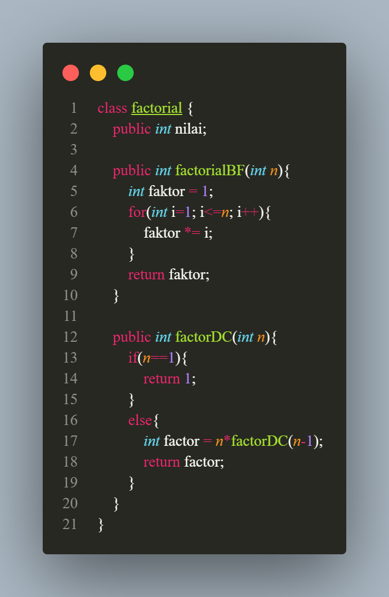
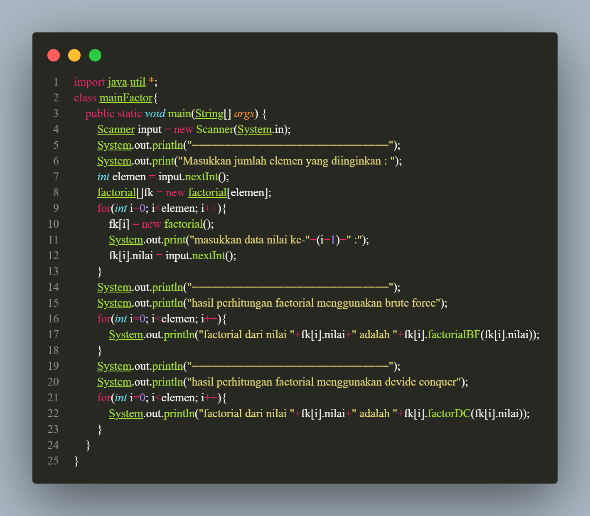
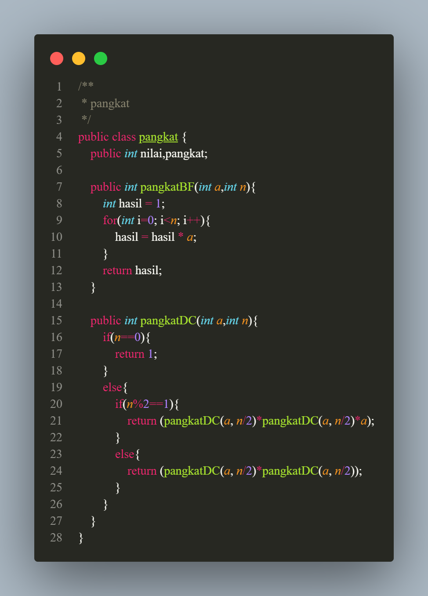
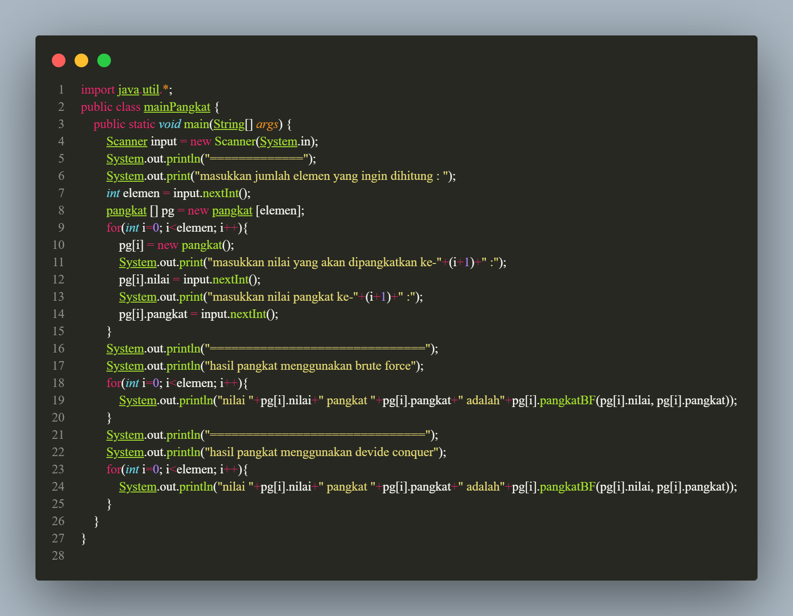

<h1 align="center">

LAPORAN PRAKTIKUM

ALGORITMA DAN STRUKTUR DATA

<h2 align="center">

RIZQI REZA DANUARTA

2241720057

TI-1C

## Latihan
### 4.2.1

jawaban pertanyaa :

1. Dalam algoritma Divide Conquer untuk pencarian nilai faktorial, submasalah yang lebih kecil adalah mencari faktorial dari n/2 dan (n/2)+1.Hasil faktorial dari n dapat dihitung dengan mengalikan hasil faktorial dari n/2 dan (n/2)+1. Konsep rekursi digunakan karena faktorial bersifat rekursif.
2. * tahap devide pada program faktorial adalah pada method factorDC(int n) factorial n dibagi menjadi sub masalah yang lebih kecil yaitu menghitung (n-1)
    * tahap conquer pada program faktorial adalah pada setiap submasalah diselesaikan secara rekursif dengan memanggil method faktorDC dipanggil dengan parameter (n-1) untuk menghitung submasalah yang lebih kecil
    *  tahap combine pada program faktorial adalah pada tahap ini seperti sudah dijelaskan di materi dimana submasalah yang lebih kecil digabungkan untuk membentuk atau menemukan solusi dari permasalahan submasalah yang besar
3. bisa mengggunakan while contoh penggunakan seperti dibawah ini
* 

4.
5.

### 4.3.1

1.
