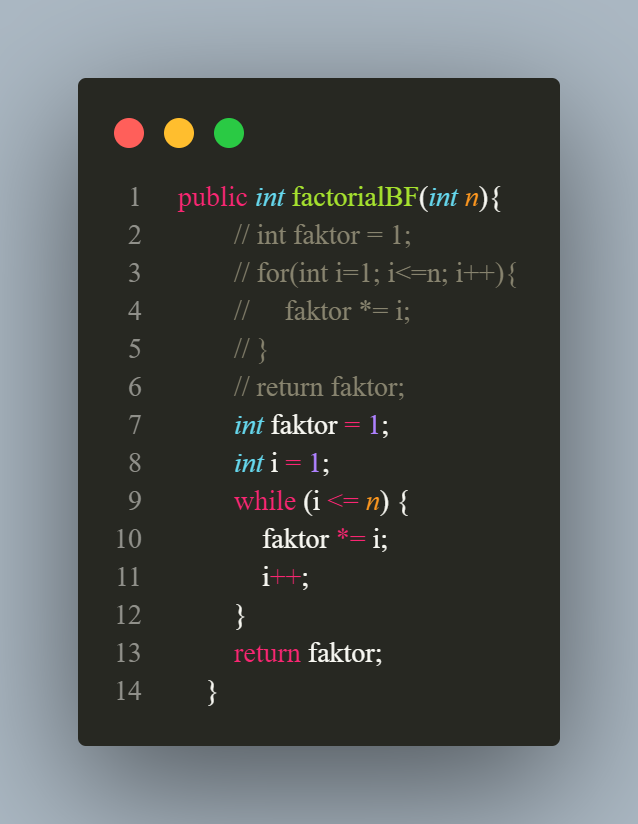

<h1 align="center">

LAPORAN PRAKTIKUM

ALGORITMA DAN STRUKTUR DATA


<h2 align="center">

RIZQI REZA DANUARTA

2241720057

TI-1C

# Latihan
## 4.2.1


jawaban pertanyaa :

1. Dalam algoritma Divide Conquer untuk pencarian nilai faktorial, submasalah yang lebih kecil adalah mencari faktorial dari n/2 dan (n/2)+1.Hasil faktorial dari n dapat dihitung dengan mengalikan hasil faktorial dari n/2 dan (n/2)+1. Konsep rekursi digunakan karena faktorial bersifat rekursif.
2. * tahap devide pada program faktorial adalah pada method factorDC(int n) factorial n dibagi menjadi sub masalah yang lebih kecil yaitu menghitung (n-1)
    * tahap conquer pada program faktorial adalah pada setiap submasalah diselesaikan secara rekursif dengan memanggil method faktorDC dipanggil dengan parameter (n-1) untuk menghitung submasalah yang lebih kecil
    *  tahap combine pada program faktorial adalah pada tahap ini seperti sudah dijelaskan di materi dimana submasalah yang lebih kecil digabungkan untuk membentuk atau menemukan solusi dari permasalahan submasalah yang besar
3. bisa mengggunakan while contoh penggunakan seperti dibawah ini
* 

4. 
``` java
import java.util.*;
class mainFactor{
    public static void main(String[] args) {
        long start = System.currentTimeMillis();
        Scanner input = new Scanner(System.in);
        System.out.println("==============================");
        System.out.print("Masukkan jumlah elemen yang diinginkan : ");
        int elemen = input.nextInt();
        factorial[]fk = new factorial[elemen];
        for(int i=0; i<elemen; i++){
            fk[i] = new factorial();
            System.out.print("masukkan data nilai ke-"+(i+1)+" :");
            fk[i].nilai = input.nextInt();
        }
        System.out.println("==============================");
        System.out.println("hasil perhitungan factorial menggunakan brute force");
        for(int i=0; i<elemen; i++){
            long end = System.currentTimeMillis();
            System.out.println("factorial dari nilai "+fk[i].nilai+" adalah "+fk[i].factorialBF(fk[i].nilai)+" waktu eksekusi : "+(end-start));
        }
        System.out.println("==============================");
        System.out.println("hasil perhitungan factorial menggunakan devide conquer");
        for(int i=0; i<elemen; i++){
            long end = System.currentTimeMillis();
            System.out.println("factorial dari nilai "+fk[i].nilai+" adalah "+fk[i].factorDC(fk[i].nilai)+" waktu eksekusi : "+(end-start));
        }
    }
}
```
5. iya terjadi perbedaan waktu karena jika user menginputkan angka 20 yang dimana angka tersebut harus diekseskusi dengan kurun waktu yang agak lama didalam proses

## 4.3.1


### Pertanyaan 4.3.3
1. pangkatBF itu menggunakan algoritma brute force sedangkan pangkatDC itu menggunakan algoritma devide conquer untuk memecah sub masalah yang besar menjadi sub masalah yang kecil dan akan di combine
2. "if(n==0)" mengecek apakah eksponen n sudah mencapai nilai 0. Jika iya, maka nilai pangkat a adalah 1, sehingga fungsi mengembalikan nilai 1.  "if(n%2==1)" mengecek apakah eksponen n adalah bilangan ganjil atau genap. Jika ganjil, maka pangkat a dihitung dengan cara memangkatkan a ke n/2, kemudian hasilnya dipangkatkan lagi dengan a, sehingga hasilnya adalah pangkat a dengan eksponen n. Jika genap, maka pangkat a dihitung dengan cara memangkatkan a ke n/2, kemudian hasilnya dipangkatkan lagi dengan a, sehingga hasilnya adalah pangkat a dengan eksponen n.
3. pada program ini langkah "combine" disatukan dengan langkah "conquer" pada bagian return dari masing-masing kondisi (ganjil atau genap).
4. 
``` java
public pangkat(int n, int p){
        this.nilai = n;
        this.pangkat = p; 
    }
```
5. 
``` java
import java.util.*;
public class mainPangkat {
    public static void main(String[] args) {
        Scanner input = new Scanner(System.in);
        boolean menu = true;
        while (menu) {
            System.out.println("Pilihan Menu Algoritma");
            System.out.println("1. Brute Force");
            System.out.println("2. Devide Conquer");
            System.out.println("3. Quit");
            System.out.print("your choise : ");
            int choise = input.nextInt();
            if(choise == 1){
                System.out.println("=============");
                System.out.print("masukkan jumlah elemen yang ingin dihitung : ");
                int elemen = input.nextInt();
                pangkat [] pg = new pangkat [elemen];
                for(int i=0; i<elemen; i++){
                    pg[i] = new pangkat(elemen, i);
                    System.out.print("masukkan nilai yang akan dipangkatkan ke-"+(i+1)+" :");
                    pg[i].nilai = input.nextInt();
                    System.out.print("masukkan nilai pangkat ke-"+(i+1)+" :");
                    pg[i].pangkat = input.nextInt();
                }
                System.out.println("==============================");
                System.out.println("hasil pangkat menggunakan brute force");
                for(int i=0; i<elemen; i++){
                    System.out.println("nilai "+pg[i].nilai+" pangkat "+pg[i].pangkat+" adalah "+pg[i].pangkatBF(pg[i].nilai, pg[i].pangkat));
                }
            }
            else if(choise == 2){
                System.out.println("=============");
                System.out.print("masukkan jumlah elemen yang ingin dihitung : ");
                int elemen = input.nextInt();
                pangkat [] pg = new pangkat [elemen];
                for(int i=0; i<elemen; i++){
                    pg[i] = new pangkat(elemen, i);
                    System.out.print("masukkan nilai yang akan dipangkatkan ke-"+(i+1)+" :");
                    pg[i].nilai = input.nextInt();
                    System.out.print("masukkan nilai pangkat ke-"+(i+1)+" :");
                    pg[i].pangkat = input.nextInt();
                }
                System.out.println("==============================");
                System.out.println("hasil pangkat menggunakan devide conquer");
                for(int i=0; i<elemen; i++){
                    System.out.println("nilai "+pg[i].nilai+" pangkat "+pg[i].pangkat+" adalah "+pg[i].pangkatBF(pg[i].nilai, pg[i].pangkat));
                }
            }
            else if(choise ==3){
                menu = false;
            }
            else{
                System.out.println("your choise can'' be detech");
            }
        }
    }
}

```

## 4.4.1
``` java
public class sum {
    public int elemen;
    public double keuntungan[];
    public double total;

    sum(int elemen){
        this.elemen = elemen;
        this.keuntungan = new double[elemen];
        this.total = 0 ;
    }

    double totalBF(double arr[]){
        for(int i=0; i<elemen; i++){
            total += arr[i];
        }
        return total;
    }

    double totalDC(double arr[], int l, int r){
        if(l==r){
            return arr[l];
        }
        else if(l<r){
            int mid = (l+r)/2;
            double lsum=totalDC(arr, l, mid-1);
            double rsum=totalDC(arr, mid+1, r);
            return lsum+rsum+arr[mid];
        }
        return 0;
    }
}
import java.util.*;

import javax.xml.transform.Source;
class mainSum{
    public static void main(String[] args) {
        Scanner input = new Scanner(System.in);
        System.out.println("=================");
        System.out.println("program menghitung keuntungan total (satuan juta. misal 5.9)");
        System.out.println("masukan jumlah bulan : ");
        int elm = input.nextInt();
        sum sm = new sum (elm);
        System.out.println("====================");
        for(int i=0; i<sm.elemen; i++){
            System.out.print("masukan untung bulan ke-"+(i+1)+" = ");
            sm.keuntungan[i] = input.nextDouble();
        }
        System.out.println("==================================");
        System.out.println("algoritma brute force ");
        System.out.println("total keuntungan perusahaan selama "+sm.elemen+" bulan adalah "+sm.totalBF(sm.keuntungan));
        System.out.println("algoritma devide conquer");
        System.out.println("total keuntungan perusahhan selama "+sm.elemen+" adalah "+sm.totalDC(sm.keuntungan, 0, sm.elemen-1));
        
    }
}
```
### Pertanyaan 4.4.3
1. 
``` java
public class Keuntungan {
    private int[] bulan = {100000000, 150000000, 200000000, 250000000};

    // Brute force method
    public int TotalBF() {
        int total = 0;
        for (int i = 0; i < bulan.length; i++) {
            total += bulan[i];
        }
        return total;
    }

    // Divide and Conquer method
    public int TotalDC(int l, int r) {
        if (l == r) {
            return bulan[l];
        } else {
            int mid = (l + r) / 2;
            int leftSum = TotalDC(l, mid);
            int rightSum = TotalDC(mid + 1, r);
            return leftSum + rightSum;
        }
    }
}
```
2. Untuk membatasi output di belakang koma agar menjadi standar kita dapat menggunakan method DecimalFormat pada class sum Kita dapat menentukan berapa banyak angka di belakang koma yang ingin ditampilkan dengan memasukkan format yang diinginkan sebagai parameter pada constructor DecimalFormat berikut dibawah ini : 
``` java
import java.text.DecimalFormat;

public class sum {
    public int elemen;
    public double keuntungan[];
    public double total;

    sum(int elemen){
        this.elemen = elemen;
        this.keuntungan = new double[elemen];
        this.total = 0 ;
    }

    double totalBF(double arr[]){
        for(int i=0; i<elemen; i++){
            total += arr[i];
        }
        DecimalFormat df = new DecimalFormat("#.##"); //format 2 angka di belakang koma
        return Double.parseDouble(df.format(total));
    }

    double totalDC(double arr[], int l, int r){
        if(l==r){
            return arr[l];
        }
        else if(l<r){
            int mid = (l+r)/2;
            double lsum=totalDC(arr, l, mid-1);
            double rsum=totalDC(arr, mid+1, r);
            DecimalFormat df = new DecimalFormat("#.##"); //format 2 angka di belakang koma
            return Double.parseDouble(df.format(lsum+rsum+arr[mid]));
        }
        return 0;
    }
}
Dalam contoh di atas, kita menggunakan format "#.##" pada objek DecimalFormat untuk membatasi output menjadi 2 angka di belakang koma. Kemudian, kita menggunakan Double.parseDouble() untuk mengubah string hasil format menjadi tipe data double yang diperlukan oleh method. Dengan demikian, output dari kedua method tersebut akan memiliki standar yang sama.
```
3. digunakan untuk mengembalikan nilai total dari array arr yang dihitung dengan menggunakan algoritma divide and conquer
4. karena variabel mid digunakan untuk mencari nilai tengah untuk memecah sub masalah
5. 
``` java 
public class sum {
    public int elemen;
    public double keuntungan[][];
    public double total;

    sum(int elemen, int bulan){
        this.elemen = elemen;
        this.keuntungan = new double[elemen][bulan];
        this.total = 0 ;
    }

    double totalBF(double arr[][]){
        for(int i=0; i<elemen; i++){
            for(int j=0; j<arr[i].length; j++) {
                total += arr[i][j];
            }
        }
        return total;
    }

    double totalDC(double arr[][], int l, int r, int bulan){
        if(l==r){
            double sum = 0;
            for(int i=0; i<bulan; i++) {
                sum += arr[l][i];
            }
            return sum;
        }
        else if(l<r){
            int mid = (l+r)/2;
            double lsum=totalDC(arr, l, mid, bulan);
            double rsum=totalDC(arr, mid+1, r, bulan);
            return lsum+rsum;
        }
        return 0;
    }
}
import java.util.*;

class MainSum{
    public static void main(String[] args) {
        Scanner input = new Scanner(System.in);
        System.out.println("=================");
        System.out.println("program menghitung keuntungan total beberapa perusahaan (satuan juta. misal 5.9)");
        System.out.print("masukan jumlah perusahaan : ");
        int perusahaan = input.nextInt();
        System.out.print("masukan jumlah bulan : ");
        int bulan = input.nextInt();
        sum sm = new sum(perusahaan, bulan);
        System.out.println("====================");
        for(int i=0; i<sm.elemen; i++){
            System.out.println("Untung perusahaan ke-" + (i+1));
            for(int j=0; j<bulan; j++) {
                System.out.print("masukan untung bulan ke-"+(j+1)+" = ");
                sm.keuntungan[i][j] = input.nextDouble();
            }
        }
        System.out.println("==================================");
        System.out.println("algoritma brute force ");
        System.out.println("total keuntungan perusahaan selama "+bulan+" bulan adalah "+sm.totalBF(sm.keuntungan));
        System.out.println("algoritma devide conquer");
        System.out.println("total keuntungan perusahhan selama "+bulan+" adalah "+sm.totalDC(sm.keuntungan, 0, sm.elemen-1, bulan));
    }
}
```
## Tugas
``` java 
import java.util.Arrays;
public class PemilihanKetuaOsis implements Comparable<PemilihanKetuaOsis> {

    public String namaKandidatSiswa;
    public int jumlahSuaraSiswa;

    PemilihanKetuaOsis(String namaKandidatSiswa, int jumlahSuaraSiswa) {
        this.namaKandidatSiswa = namaKandidatSiswa;
        this.jumlahSuaraSiswa = jumlahSuaraSiswa;
    }

    public int compareTo(PemilihanKetuaOsis o) {
        return o.jumlahSuaraSiswa - this.jumlahSuaraSiswa;
    }

    public static String hitungPemilihanSuara(PemilihanKetuaOsis[] siswa) {
        Arrays.sort(siswa);
        int maxElement = -1;
        PemilihanKetuaOsis temp = siswa[0];
        int element = 0;
        int banyakSiswa = siswa.length;
        for (int i = 1; i < banyakSiswa; i++) {
            if (temp.namaKandidatSiswa.equals(siswa[i].namaKandidatSiswa)) {
                temp.jumlahSuaraSiswa += siswa[i].jumlahSuaraSiswa;
            } else {
                if (maxElement < temp.jumlahSuaraSiswa) {
                    maxElement = temp.jumlahSuaraSiswa;
                    element = i - 1;
                }
                temp = siswa[i];
            }
        }
        if (maxElement < temp.jumlahSuaraSiswa) {
            maxElement = temp.jumlahSuaraSiswa;
            element = banyakSiswa - 1;
        }
        int n = banyakSiswa;
        if (maxElement > (n / 2)) {
            return "Ketua terpilih adalah " + siswa[element].namaKandidatSiswa;
        } else {
            return "Tidak ada ketua terpilih";
        }
    }
}
import java.util.*;
public class PemilihanMain {
    public static void main(String[] args) {
        Scanner input = new Scanner(System.in);
        System.out.print("Masukkan banyak kandidat siswa: ");
        int banyakKandidat = input.nextInt();

        PemilihanKetuaOsis[] siswa = new PemilihanKetuaOsis[banyakKandidat];

        for (int i = 0; i < siswa.length; i++) {
            input.nextLine(); // membersihkan buffer setelah input sebelumnya
            System.out.println("Kandidat ke-" + (i+1));
            System.out.print("Masukkan nama: ");
            String namaKandidat = input.nextLine();
            System.out.print("Masukkan jumlah suara: ");
            int jumlahSuara = input.nextInt();
            System.out.println("------------------------------");
            siswa[i] = new PemilihanKetuaOsis(namaKandidat, jumlahSuara);
        }

        System.out.println(PemilihanKetuaOsis.hitungPemilihanSuara(siswa));
    }
}
```


